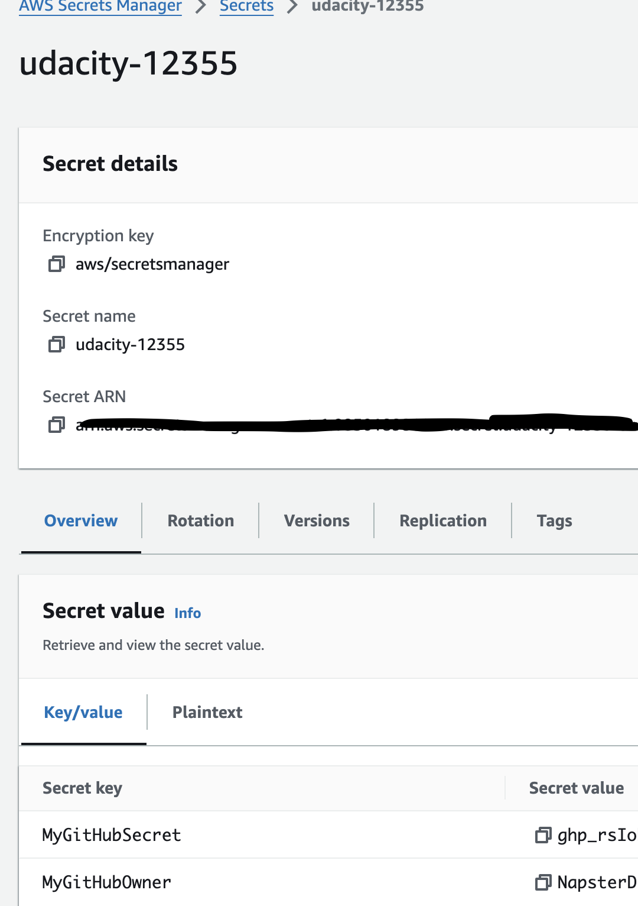

# CD12355 - Microservices AWS Kubernetes Project Starter

# Project Scenario
The Coworking Space Service is a set of APIs that enables users to request one-time tokens and administrators to authorize access to a coworking space. This service follows a microservice pattern and the APIs are split into distinct services that can be deployed and managed independently of one another.

For this project, you are a DevOps engineer who will be collaborating with a team that is building an API for business analysts. The API provides business analysts basic analytics data on user activity in the service. The application they provide you functions as expected locally and you are expected to help build a pipeline to deploy it in Kubernetes.

# Spin up instructions
## 1. Get Github token and store it in Secret Manager
- If you pass the Github token into Cloudformation template instead of storing it in Secret Manager, after creation stacks finished, the information of parameter will be visible in Parameters Tab of Cloudformation Stack Details
- Follow this guide to get Github token <a href="https://docs.github.com/en/authentication/keeping-your-account-and-data-secure/managing-your-personal-access-tokens">here</a>
- Create key/value secret in Secret Manager with secretKey must be: `MyGithubSecret` and `MyGithubOwner`.
<p align="center">
</p>

## 2. Run below script for creating AWS Code Build, AWS ECR, AWS CodePipeline by Cloudformation 
- Run this script to get Account number, then pass it into `coworking-parameters.json`
```bash
aws sts get-caller-identity --query "Account" --output text
```
- Create stack
```bash
cd ./deliverables/cloudformation

./script.sh deploy us-east-1 tsu-cd12355-pipeline pipeline.yml pipeline-parameters.json
```
- Check status of stack creation in Cloudformation Stack Details

## 3. Create EKS Cluster
- Install Kubetcl <a href="https://eksctl.io/installation/">here</a>
- Create cluster
```bash
eksctl create cluster --name tsu-cluster --region us-east-1 --nodegroup-name tsu-nodes --node-type t3.small --nodes 1 --nodes-min 1 --nodes-max 2
```
- Update context to the local Kube config file
```bash
aws eks --region us-east-1 update-kubeconfig --name tsu-cluster
```
- Verify context name
```bash
kubectl config current-context
```
Output: `arn:aws:eks:us-east-1:085018986241:cluster/tsu-cluster` => the cluster has been created successfully

- NOTE: When you finish your project, use the following command to delete your EKS cluster
```bash
eksctl delete cluster --name tsu-cluster --region us-east-1
```
## 4. Set up a Postgres database
- Before you start, ensure you are connected to your K8s cluster
```bash
kubectl get namespace
```
- Create PersistentVolumeClaim, PersistentVolume and deploy it to cluster
```bash
cd ./db
kubectl apply -f pvc.yaml
kubectl apply -f pv.yaml
kubectl apply -f postgresql-deployment.yaml
```
- View the pods to get postgresql pod name
```bash
kubectl get pods
```
- Assuming the postgres pod name is `postgresql-5c89cdb65-w2tsf`, run the following command to open bash into the pod.
```bash
kubectl exec -it postgresql-5c89cdb65-w2tsf -- bash
```
- Once you are inside the pod, you can run
```bash
psql -U tsu-user -d tsu-coworking-db
```
- Use `\l` to list out all database and `\c tsu-coworking-db` to access to specific database
- Create pogresql service, secret and expose it using port-forwarding approach:
```bash
kubectl apply -f postgresql-service.yaml
kubectl apply -f postgresql-secret.yaml 
```
- List service and set up port-forwarding to `postgresql-service`
```bash
# List the services
kubectl get svc

# The command above opens up port forwarding from your local environment's port 5433 to the node's port 5432. The & at the end ensures the process runs in the background.
kubectl port-forward svc/postgresql-service 5433:5432 &
```
- Run seed files (make sure you already install `psql`)
```bash
cd ./db
export DB_PASSWORD=123456
PGPASSWORD="$DB_PASSWORD" psql --host 127.0.0.1 -U tsu-user -d tsu-coworking-db -p 5433 < 1_create_tables.sql
PGPASSWORD="$DB_PASSWORD" psql --host 127.0.0.1 -U tsu-user -d tsu-coworking-db -p 5433 < 2_seed_users.sql
PGPASSWORD="$DB_PASSWORD" psql --host 127.0.0.1 -U tsu-user -d tsu-coworking-db -p 5433 < 3_seed_tokens.sql
psql --host 127.0.0.1 -U tsu-user -d tsu-coworking-db -p 5433
```
- Execute query `select *from users`for to ensure they not empty

- NOTE: When you finish project, you must close forward port
```bash
ps aux | grep 'kubectl port-forward' | grep -v grep | awk '{print $2}' | xargs -r kill
```

4. Build analytics app locally
- Make sure you have `pip`, run this comment to install dependency
```bash
pip install -r requirements.txt
```
- Set environment variables and run application
```bash
# Set up port forwarding
kubectl port-forward svc/postgresql-service 5433:5432 &  
# Export the password. Replace 
export DB_USERNAME=$(kubectl get secret postgresql-secret -o jsonpath="{.data.POSTGRES_USER}" | base64 --decode)
export DB_PASSWORD=$(kubectl get secret postgresql-secret -o jsonpath="{.data.POSTGRES_PASSWORD}" | base64 --decode)
export DB_HOST=127.0.0.1
export DB_PORT=5433
export DB_NAME=$(kubectl get secret postgresql-secret -o jsonpath="{.data.POSTGRES_DB}" | base64 --decode)
python3 app.py
```
- Verify application
```bash
curl 127.0.0.1:5153/api/reports/daily_usage
```


# Tear down instructions

# Stand out instructions

Test
